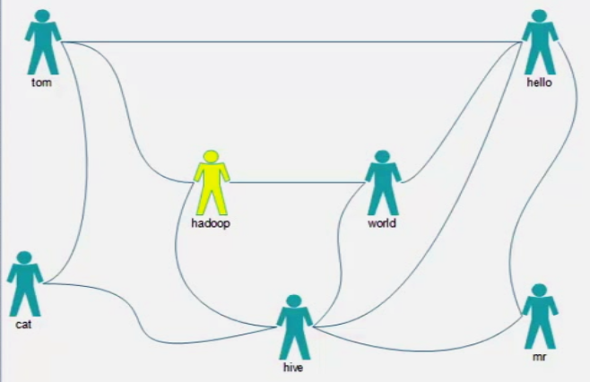

# 功能说明

    为hadoop做好友推荐
 


* 步骤
    1. 找到所有的二度关系
        
       在同一个用户的好友列表里，两个好友两两之间都是二度关系
        
    2. 拿到真正的二度关系（亲密度），去除已知好友关系
    3. 用户名升序：亲密度降序排序
    
* 数据模拟
    * 数据
    ```
        tom hello hadoop cat
        world hadoop hello hive
        cat tom hive
        mr hive hello
        hive cat hadoop world hello mr
        hadoop tom hive world
        hello tom world hive mr
    ```
    * 推导
    ```
        tom-hello       0
        tom-hadoop      0
        tom-cat         0
        hello-hadoop    1
        hello-cat       1
        hadoop-cat      1
  
        world-hadoop    0
        world-hello     0
        world-hive      0
        hadoop-hello    1
        hadoop-hive     1
        hello-hive      1
  
        ... ...
        
        1.  将已知好友关系标识为0，如tom与hello、hadoop、cat
            将未知好友关系标识为1，如hello月hadoop、cat
        2.  统计两人关系，一旦两人关系中出现0，则为已知好友关系，移除；其余汇总即为亲密度
        
    ```
