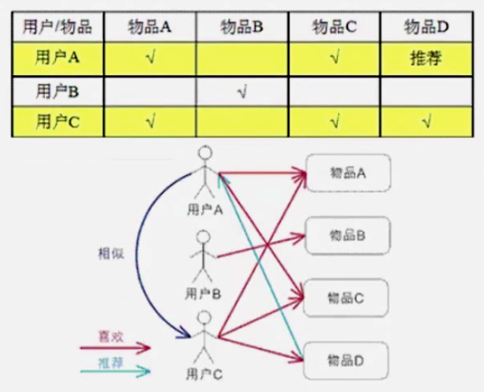

# 推荐算法

## 1. 分类

按数据使用划分：

*   协同过滤算法
    *   UserCF
    *   ItemCF
    *   ModelCF
*   基于内容的推荐
    *   用户内容属性
    *   物品内容属性
*   社会化过滤
    *   基于用户的社会网络关系
    
## 2. UserCF
> 通过用户对物品的评分来评测用户之间的相似性，基于用户之间的相似性做推荐。
> 即：给用户推荐和他兴趣相似的其他用户喜欢的物品。

### 2.1 用例说明

## 3. ItemCF
> 通过用户对不同item的评分来评测item之间的相似性，基于item之间的相似性做推荐。
> 即：给用户推荐和他之前喜欢的物品相似的物品。
> * 注意：基于物品的协同过滤算法，是目前商用最广泛的推荐算法

### 3.1 用例说明

### 3.2 案例：天池大数据竞赛
#### 3.2.1 案例说明

#### 3.2.2 案例数据分析

##### 3.2.2.1 计算步骤
1.  构建同现矩阵
2.  构建用户矩阵
3.  矩阵相乘
4.  结果排序

#### 3.2.3 代码实现
##### 3.2.3.1 数据

> click: 点击， cart：购物车， alipay：购买

##### 3.2.3.2 实现步骤
1. 数据清洗
2. 