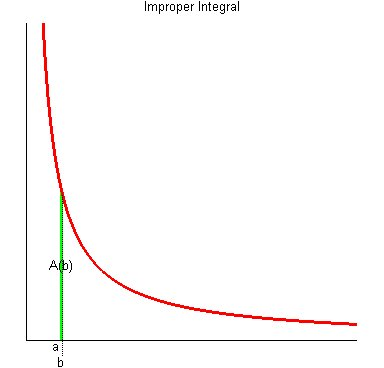

# PageRank

*   PageRank 算法
    *   用于衡量特定网页相对于搜索引擎索引中的其他网页而言的重要程度的专有算法
    *   实现了将**链接价值概念**作为排名因素
    *   PR值：范围1-10，例如7、8就很高了，但每个搜索引擎算法有差异

*   站长工具
    
    查看PR值

*   算法原理
    *   入链
        *   PageRank 让链接来“投票”，到一个页面的超链接相当于对改业投一票
    *   入链数量
        *   若一个页面节点接受到的其他网页指向的入链数量越多，那么该页面越重要
    *   入链质量
        *   指向页面A的入链质量不同，质量高的页面会通过链接向其他页面传递更多权重
        *   越是质量高的页面指向页面A，则页面A越重要
    *   初始值
        *   每个页面设置相同的PR值
        *   Google 的 PageRank 算法给每个页面的PR初始值为1
    *   迭代递归算法（收敛）
        *   Google 不断重复计算每个页面的 PageRank，经过不断重复计算，页面的PR值会趋于稳定，即收敛状态
        *   在具体企业应用中怎样确定收敛标准？
            1.  每个页面的 PR 值和上一次计算的PR相等
            2.  设定一个差值指标（0.0001）。当所有页面和上一次计算的 PR 差值平均小于该标准时，即收敛
            3.  设定一个百分比（99%），当 99% 的页面和上一次计算的 PR 相等，即收敛
    *   修正 PageRank 计算公式
        *   由于存在一些出链为0，即那些不链接任何其他页面的孤立网页，使得很多页面能被访问到。因此需要对 PageRank 公式进行修正，即在简单公式的基础上增加了阻尼系数（damping factor）q，q一般取值0.85
    *   完整 PageRank 计算公式
        
       
       
       L(Pj)：Pj页面投出过多少票
       Pj   ：Pj向Pi投过票
       q    ：阻尼系数

*   案例分析

       
       
       假设ABCD四个页面之间链接关系如图所示，分析如下：
       
*   第一轮：设四个页面的投票得分均为 1
*   第二轮：
```
    A页面：1/2(C)
    B页面：3/2     =   1/2(C)+1/2(A)+1/2(D)
    C页面：3/2     =   1/2(D)+1(B)
    D页面：1/2(A)
```

*   第三轮：
```
    A页面：3/4(C)
    B页面：5/4     =   3/4(C)+1/4(A)+1/4(D)
    C页面：7/4     =   1/4(D)+3/2(B)
    D页面：1/4(A)
```

*   迭代：

    随着计算迭代，各页面的得分之间的差距会逐渐趋于平稳（收敛），如下图所示：



*   测试数据

```
A   B   D
B   C
C   A   B
D   B   C
```