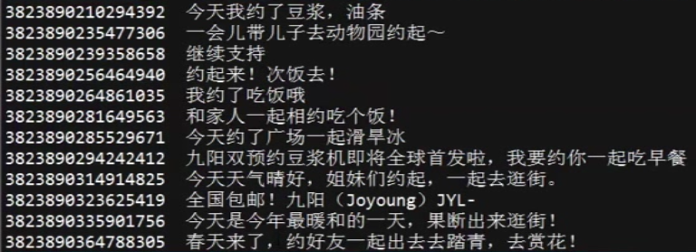

# TFIDF

## 1. 概念

*   TF-IDF(term frequency - inverse document frequency) 是一种用于资讯检索与资讯勘探的**常用加权技术**
*   TF-IDF是一种统计方法，用以评估一字词对于一个文件集或一个语料库中的其中一份文件的重要程度
*   字词的重要性随着它在文件中出现的次数成正比增加，但同时会随着它在语料库中出现的频率成反比下降
*   TF-IDF加权的各种形式常备搜索引擎应用，作为文件与用户查询之间相关程度的度量或评级。除TF-IDF外，搜索引擎还会使用基于链接分析的评级方法，以确定文件在搜索结果中出现的顺序

## 2. 原理
### 2.1 词频（TF，term frequency)

    * 词频指的是某个给定的词语在一份给定的文件中出现的次数。
    * 这个数字通常会被 归一化（分子一般小于分母，区别于IDF)，以防止它偏向长的文件。
    * 同一个词语在长文件里可能会比短文件有更高的词频，而不管该词语重要与否。

### 2.2 逆向文件频率（IDF，inverse document frequency）

    * 度量一个词语普遍重要性
    * 某一特定词语的IDF，可由总文件数除以包含该词语的文件数，再将结果取对数
    
>   * 特定文件内高词语频率 + 该词语在文件集合中的低文件频率 => 高权重 TF-IDF
>   * TF-IDF 倾向于 过滤掉常见的词语，保留重要的词语

### 2.3 公式

* tf(i,j)公式说明
    *   分子：n(i,j) 是 词语 t(i) 在文件 d(j) 中出现的次数
    *   分母：在文件 d(j) 中所有字词的出现次数之和

* idf(i) 公式说明
    *   分子：|D| 是语料库中的文件总数
    *   分母：|{j:t(i) ∈ d(j)}| 即 包含词语 t(i) 的文件书目（即n(i,j)≠0的文件数目）。若词语不在语料库中，会导致除数为0，顾一般使用 1+|{j:t(i) ∈ d(j)}|

### 2.4 测试数据样例

    说明：
        *   前面的数字表示一条微博的ID
        *   后面的文本表示一条微博的内容