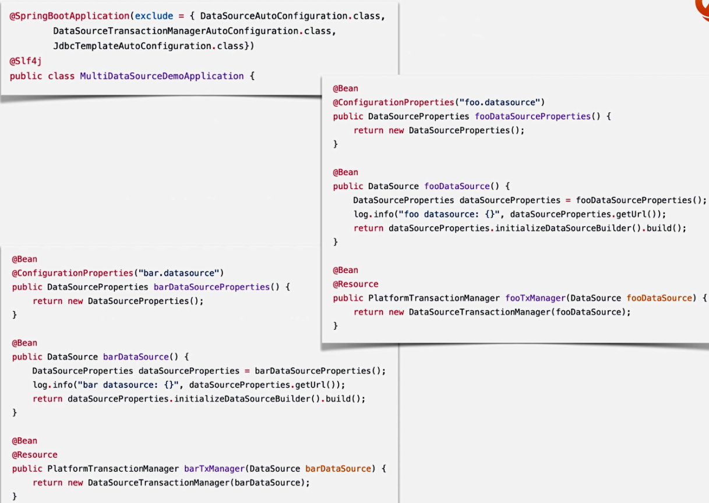
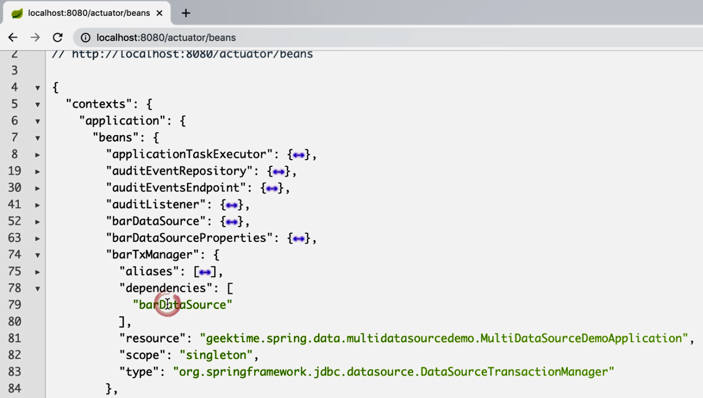

# Spring Boot 中的多数据源配置
## 方式一：配置主数据源 @Primary
## 方式二：排除 SpringBoot 的自动配置
*   exclude
    *   DataSourceAutoConfiguration
    *   DataSourceTransactionManagerAutoConfiguration
    *   JdbcTemplateAutoConfiguration

