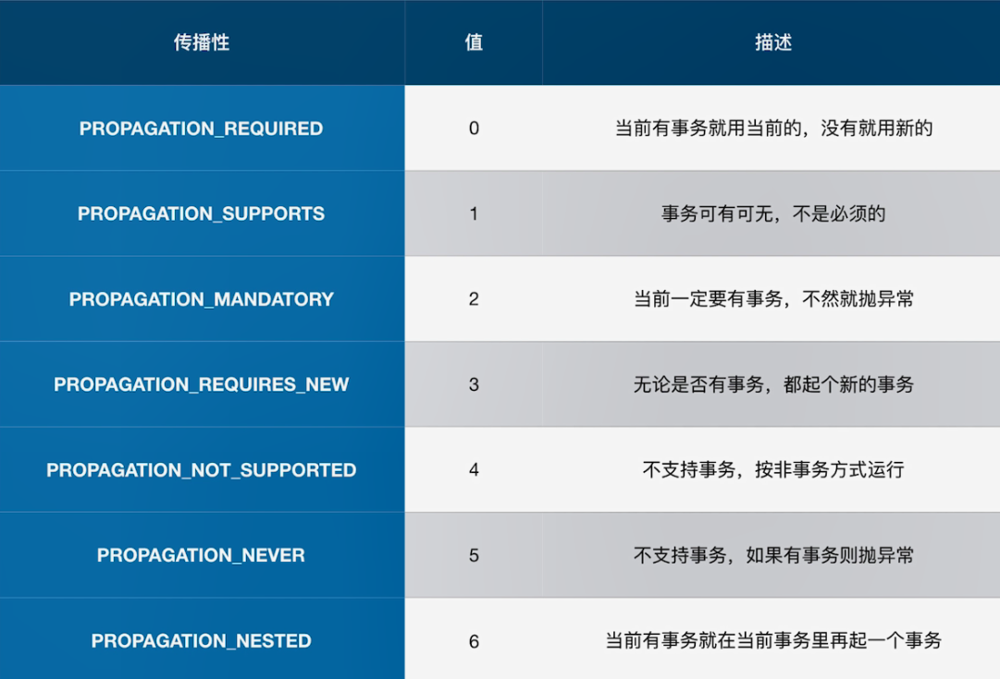
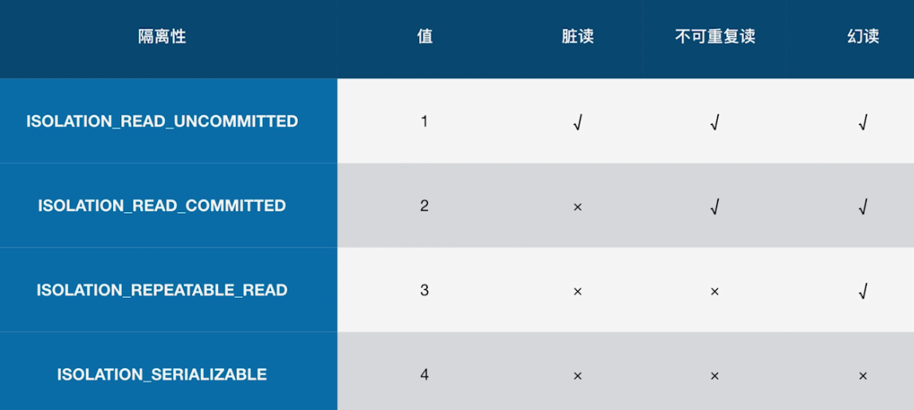
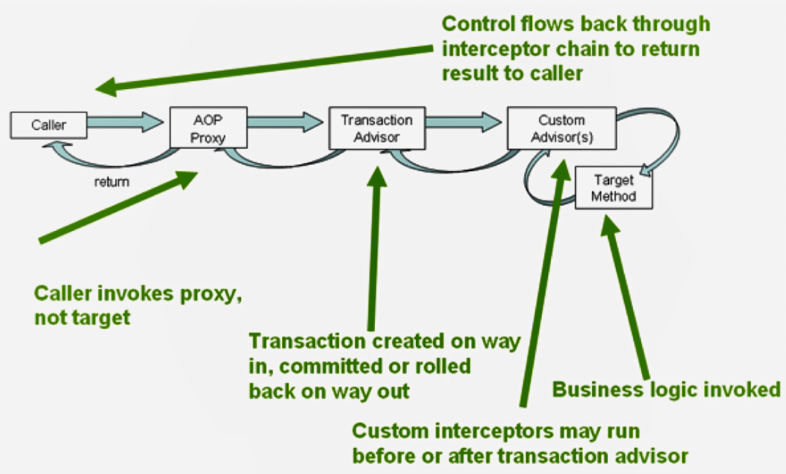

Spring的事务抽象
一致的事务模型
●JDBC/Hibernate/myBatis
●DataSource/JTA

事务抽象的核心接口
Platform TransactionManager
●DataSource TransactionManager
●Hibernate TransactionManager
●JtaTransactionManager

TransactionDefinition
●Propagation
●lsolation
●Timeout
●Read-only status

void commit (TransactionStatus status) throws TransactionException;
void rollback(TransactionStatus status) throws TransactionException;
TransactionStatus getTransaction(@Nullable TransactionDefinition definition) throws Transact ionException;

事务传播特性

事务隔离特性

编程式事务
TransactionTemplate
●TransactionCallback
●TransactionCallbackWithoutResult
PlatformTransactionManager
●可以传入TransactionDefinition进行定义

声明式事务

基于注解的配置方式
开启事务注解的方式
●@Enable TransactionManagement
●<tx:annotation-driven/>
一些配置
●proxy TargetClass
●mode
●order

@Transactional
●transactionManager
●propagation
●isolation
●timeout
●readOnly
●怎么判断回滚

